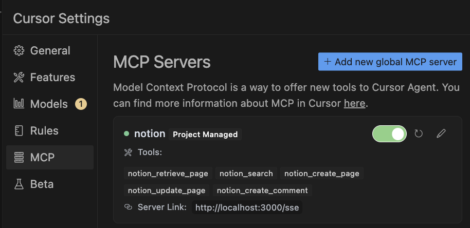

# Notion MCP Server

This project implements a Model Context Protocol (MCP) server for the Notion API supporting both Server-Sent Events (SSE) and Streamable HTTP transport mechanisms. It allows AI assistants and other applications to interact with Notion workspaces in a standardized way.

## Features

- Implements the Model Context Protocol (MCP) version 2024-11-05
  - **Server-Sent Events (SSE)**: `/sse`
  - **Streamable HTTP**: `/mcp`
- Provides access to Notion API functionality through MCP tools
- Compatible with Claude, Cursor, and other MCP clients

**Available Tools**: The server exposes the following Notion API capabilities as MCP tools:

- `notion_retrieve_page`: Retrieve a Notion page by ID
- `notion_search`: Search for pages in Notion
- `notion_create_page`: Create a new page in Notion
- `notion_update_page`: Update an existing page in Notion
- `notion_create_comment`: Create a comment on a page or block

## Usage

### Using Docker Image

You can quickly get started with the pre-built Docker image:

1. Create an `.env` file with your Notion credentials:
   ```
   NOTION_TOKEN=your_notion_integration_token
   NOTION_VERSION=2022-06-28
   ```

2. Run the Docker container:
   ```bash
   docker run -p 3000:3000 --env-file .env nakamasato/notion-mcp-server:0.1.1
   ```

3. Configure your MCP client to connect to the server:

   Example: **Cursor AI**:

   ```json
   {
      "mcpServers": {
        "notion": {
            "url": "http://localhost:3000/sse"
        }
      }
   }
   ```

   

   For more detailed configuration instructions for Claude Desktop, Zed, and other clients, see the [client-config-example.md](client-config-example.md) file.

## Local Run

### Prerequisite

- Node.js 20 or higher
- A Notion integration token (get one from [Notion Integrations](https://www.notion.so/profile/integrations))
- Pages or databases shared with your Notion integration

### Installation

1. Clone this repository:
   ```bash
   git clone https://github.com/nakamasato/notion-mcp-server.git
   cd notion-mcp-server
   ```

2. Install dependencies:
   ```bash
   npm install
   ```

3. Set up your Notion API credentials as environment variables:
   ```bash
   export NOTION_TOKEN="your_notion_integration_token"
   export NOTION_VERSION="2022-06-28"
   ```

### Running the Server

For development with auto-reload:
```bash
npm run dev
```

For direct TypeScript execution (recommended for local development):
```bash
npx tsx src/index.ts
```

By default, the server runs on port 3000. You can customize this with the `PORT` environment variable.

### Running with Docker

1. Start the server:
```bash
docker compose up
```

To stop the server:
```bash
docker compose down
```

The server will automatically restart unless explicitly stopped.


## Client Configuration

For detailed client configuration examples, please see the [client-config-example.md](client-config-example.md) file, which includes setup instructions for:

- Claude Desktop
- Cursor AI
- Cline
- Zed
- MCP Inspector
- Curl examples


## References

- https://www.npmjs.com/package/@modelcontextprotocol/sdk
- https://modelcontextprotocol.io/quickstart/server#node
- https://github.com/modelcontextprotocol/quickstart-resources/tree/main/weather-server-typescript
- https://azukiazusa.dev/blog/mcp-server-streamable-http-transport/
- https://github.com/modelcontextprotocol/typescript-sdk/tree/main/src/examples

## License

MIT
