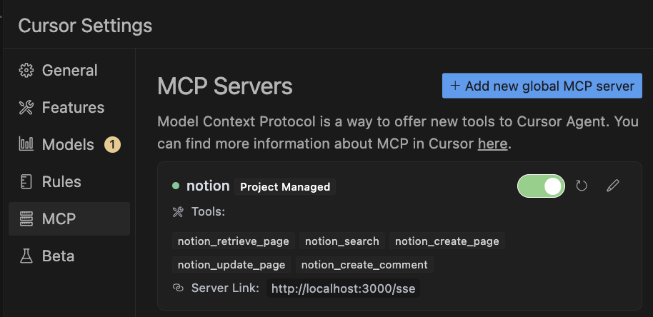

# MCP Client Configuration Examples

This document provides examples of how to configure various MCP clients to work with the Notion MCP Server.

## Claude Desktop

To configure Claude Desktop to use the Notion MCP Server, add the following to your Claude Desktop configuration file, which is typically located at:

- macOS: `~/Library/Application Support/Claude/claude_desktop_config.json`
- Windows: `%APPDATA%\Claude\claude_desktop_config.json`
- Linux: `~/.config/Claude/claude_desktop_config.json`

```json
{
  "mcpServers": {
    "notion": {
      "url": "http://localhost:3000/sse"
    }
  }
}
```

> [!WARN]
> This is not supported yet. please configure in the following way.

Configuration using mcp-remote:

```json
{
    "mcpServers": {
        "notion": {
            "command": "npx",
            "args": [
                "mcp-remote",
                "http://localhost:3000/sse"
            ]
        }
    }
}
```


## Cursor AI

To configure Cursor AI to use the Notion MCP Server, add the following to your `.cursor/mcp.json` file:

```json
{
  "mcpServers": {
    "notion": {
      "url": "http://localhost:3000/sse"
    }
  }
}
```

Alternative configuration:

```json
{
  "mcpServers": {
    "notion": {
      "url": "http://localhost:3000/sse"
    }
  }
}
```



## Cline

To configure Cline to use the Notion MCP Server, add the following to your configuration:

```json
{
  "mcp_servers": {
    "notion": {
      "url": "http://localhost:3000/sse"
    }
  }
}
```

## Zed

To configure Zed to use the Notion MCP Server, add the following to your Zed configuration:

```json
{
  "mcpServers": [
    {
      "name": "notion",
      "url": "http://localhost:3000/sse"
    }
  ]
}
```

## Custom MCP Clients

For custom MCP clients that connect using the SSE transport, you'll need to:

1. Connect to the `/sse` endpoint to establish the SSE connection
2. Send JSON-RPC requests to the `/messages?sessionId=<session-id>` endpoint, where `<session-id>` is the session ID received from the server
3. Receive JSON-RPC responses via the SSE connection

The server uses the following endpoint structure:

- `GET /sse` - SSE connection endpoint
- `POST /messages?sessionId=<session-id>` - Endpoint for client-to-server messages

## MCP Inspector

To debug and test the server with MCP Inspector:

```
npx @modelcontextprotocol/inspector node build/index.js
```

Open http://127.0.0.1:6274/#resources

SSE:


Streamable HTTP:


## Example Usage with curl

### 1. Establish SSE Connection

First, establish an SSE connection to get a client ID:

```bash
curl -N -H "Accept: text/event-stream" http://localhost:3000/sse
```

You should see a response like this:
```
data: /messages?sessionId=09196447-5816-476e-8dce-e58166ba0e1b
```

### 2. List Available Tools

Get the `SESSION_ID` from the server logs and use it to list available tools:

```bash
curl -X POST -H "Content-Type: application/json" \
  -d '{"jsonrpc":"2.0","id":"1","method":"tools/list","params":{}}' \
  "http://localhost:3000/messages?sessionId=$SESSION_ID"
```

You'll see the tool list in the logs:
```json
data: {"jsonrpc":"2.0","id":"1","result":{"tools":[{"name":"notion_retrieve_page","description":"Retrieves a Notion page by its ID","parameters":{"type":"object","properties":{"page_id":{"type":"string","description":"The ID of the page to retrieve"}},"required":["page_id"]}},{"name":"notion_search","description":"Searches for pages in Notion","parameters":{"type":"object","properties":{"query":{"type":"string","description":"The search query"},"filter":{"type":"object","description":"Optional filter for search results"},"sort":{"type":"object","description":"Optional sort for search results"}},"required":["query"]}},{"name":"notion_create_page","description":"Creates a new page in Notion","parameters":{"type":"object","properties":{"parent":{"type":"object","description":"The parent of the page"},"properties":{"type":"object","description":"The properties of the page"},"children":{"type":"array","description":"The content of the page"}},"required":["parent"]}},{"name":"notion_update_page","description":"Updates a page in Notion","parameters":{"type":"object","properties":{"page_id":{"type":"string","description":"The ID of the page to update"},"properties":{"type":"object","description":"The properties to update"}},"required":["page_id"]}},{"name":"notion_create_comment","description":"Creates a comment in Notion","parameters":{"type":"object","properties":{"parent":{"type":"object","description":"The parent of the comment"},"rich_text":{"type":"array","description":"The content of the comment"}},"required":["parent","rich_text"]}}]}}
```

### 3. Call Tools

Use the client ID from the SSE connection to call tools. Here are some examples:

#### Retrieve a Page

```
NOTION_PAGE_ID=xxx
```

```bash
curl -X POST http://localhost:3000/messages?sessionId=$SESSION_ID \
  -H "Content-Type: application/json" \
  -d '{
    "jsonrpc": "2.0",
    "id": "1",
    "method": "mcp/callTool",
    "params": {
      "name": "notion_retrieve_page",
      "parameters": {
        "page_id": "'$NOTION_PAGE_ID'"
      }
    }
  }'
```

#### Search Pages
```bash
curl -X POST http://localhost:3000/messages?sessionId=$SESSION_ID \
  -H "Content-Type: application/json" \
  -d '{
    "jsonrpc": "2.0",
    "id": "1",
    "method": "tools/call",
    "params": {
      "name": "notion_search",
      "arguments": {
        "query": "your search query"
      }
    }
  }'
```

#### Create Page
```bash
curl -X POST http://localhost:3000/messages?sessionId=$SESSION_ID \
  -H "Content-Type: application/json" \
  -d '{
    "jsonrpc": "2.0",
    "id": "1",
    "method": "tools/call",
    "params": {
      "name": "notion_create_page",
      "arguments": {
        "parent": {
          "database_id": "your-database-id"
        },
        "properties": {
          "Name": {
            "title": [
              {
                "text": {
                  "content": "New Page Title"
                }
              }
            ]
          }
        }
      }
    }
  }'
```

Note: Use real Notion page IDs and database IDs in the requests.
